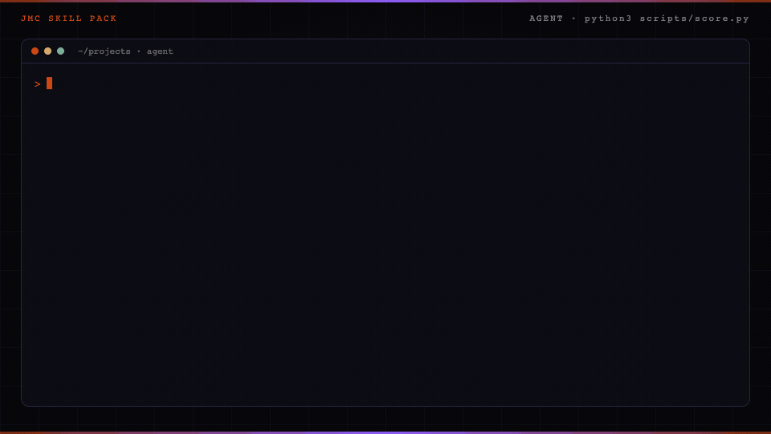

<p align="center">
  
</p>

# Sales offer skill for Claude Code

A sales offer is what the buyer gets, what it costs, and why now.

The sample homepage asks for a meeting before it shows any work.

The good first email hands over that finding. The draft that says "buy the retainer" fails the score.

<p align="center">
  
</p>

The build guide teaches a human. The pack teaches an agent.

The scorer is Python in this repo. It does not call a paid API. Host paths are on the [Skill packs catalog](https://jaymountconsulting.com/skills).

## Install

Claude Code:

```text
/plugin marketplace add cmj-hub/gtm-operator-skills
/plugin install sales-offer@gtm-operator-skills
```

Other agents:

```text
npx skills add cmj-hub/claude-sales-offer --all -g --full-depth
```

## What you walk out with in 15 minutes

Artifact: `skills/cold-offer/examples/offer-good.json`.

```bash
cd skills/cold-offer
python3 scripts/score.py --file examples/offer-good.json
python3 scripts/score.py --file examples/offer-sells.json
```

The good draft exits 0 and prints the leak, the prototype, and email one. The sell draft exits 1 and names the phrases that sold. Then drop in yours. Add `--json` for a machine-readable result.

## What this pack will not do

It will not send the email. It does not book a meeting. It will not let email one sell the paid product.

## Does this send the offer?

No. It scores the draft. You send it from your own sequencer.

## What fails the score?

Email one that sells the paid product. The first email delivers the finding. The paid product stays behind a yes.

The scorer also fails email one that asks for a meeting, that never states the finding, or that runs past 120 words. Each failure names the phrase that tripped it and the fix.

## Layout

```
.claude-plugin/plugin.json      plugin manifest
skills/cold-offer/SKILL.md      the skill the agent loads
skills/cold-offer/scripts/      score.py
skills/cold-offer/examples/     good and sell drafts
tests/                          python3 -m unittest discover -s tests
```

## On the site

- [Sales offer pack](https://jaymountconsulting.com/skills/claude-sales-offer) — this pack's page
- [Skill packs catalog](https://jaymountconsulting.com/skills) — install paths + every pack

## Free, no signup

[All free tools](https://jaymountconsulting.com/prototypes)

## Free, by email

[**Growth Audit**](https://jaymountconsulting.com/growth-audit) — architecture gaps in the GTM you already run. Free written report.

[**Friday Signal**](https://jaymountconsulting.com/newsletter/signal) — one Friday GTM read. No pitch in it.

## Next

Previous: [Pricing strategy](https://github.com/cmj-hub/claude-pricing)

Next: [Landing page](https://github.com/cmj-hub/claude-landing-page)

## License

MIT. No paid APIs. Python 3 standard library only.
